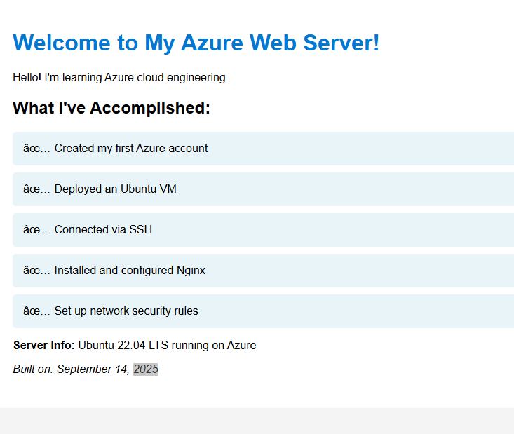
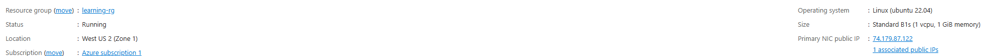
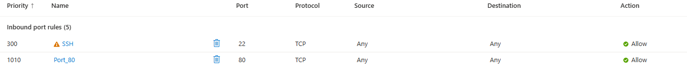

# My First Azure Web Server

A hands-on project demonstrating cloud infrastructure deployment and web server configuration on Microsoft Azure.

## Project Overview

This project showcases my journey into Azure cloud engineering by deploying and configuring a web server on a Linux virtual machine. The result is a live website accessible from anywhere on the internet.

## What I Built

- **Ubuntu 22.04 LTS Virtual Machine** running on Azure
- **Nginx Web Server** hosting a custom webpage
- **Network Security Configuration** allowing HTTP traffic
- **Custom HTML webpage** documenting my learning progress

## Live Demo

🌐 **Website URL:** `http://74.179.87.122`

## Technical Skills Demonstrated

### Azure Cloud Services
- Virtual Machine deployment and management
- Resource Group organization
- Network Security Group configuration
- Azure Portal navigation

### Linux System Administration
- SSH remote connection and authentication
- Package management with `apt`
- System service management with `systemctl`
- File system navigation and permissions
- Command-line text editing with `nano`

### Web Technologies
- Nginx installation and configuration
- HTML/CSS development
- HTTP protocol understanding
- Port configuration (80 for HTTP)

## Architecture

```
Internet → Azure Load Balancer → Network Security Group → Ubuntu VM → Nginx → Custom Website
```

## Step-by-Step Process

1. **Azure Setup**
   - Created free Azure account with $200 credits
   - Set up resource group for project organization

2. **Virtual Machine Deployment**
   - Deployed Ubuntu 22.04 LTS VM (Standard_B1s)
   - Configured SSH access (port 22)
   - Troubleshooted availability zone capacity issues

3. **Linux Server Configuration**
   - Connected via SSH from Windows Terminal
   - Updated system packages (`sudo apt update`)
   - Installed Nginx web server (`sudo apt install nginx`)

4. **Network Configuration**
   - Added inbound security rule for HTTP (port 80)
   - Tested connectivity and firewall settings

5. **Web Development**
   - Created custom HTML webpage with CSS styling
   - Replaced default Nginx welcome page
   - Implemented responsive design elements

## Key Learnings

- **Problem-Solving:** Overcame Azure availability zone limitations by adapting deployment strategy
- **Security:** Understood the importance of network security groups and controlled access
- **Documentation:** Learned to document technical processes for reproducibility
- **Command Line:** Gained confidence with Linux command-line operations
- **Infrastructure as Code:** Recognized the value of automation and version control for infrastructure

## Files in This Repository

- `index.html` - Custom webpage source code
- `README.md` - This documentation file

## Future Enhancements

- Implement HTTPS with SSL certificates
- Add Infrastructure as Code using ARM templates
- Set up automated deployments with Azure DevOps
- Implement monitoring and alerting with Azure Monitor
- Scale to multi-VM architecture with load balancing

## Resources Used

- [Azure Free Account](https://azure.microsoft.com/free/)
- [Ubuntu Server Documentation](https://help.ubuntu.com)
- [Nginx Documentation](https://nginx.org/en/docs/)

## Connect With Me

This project represents my first steps into cloud engineering. I'm actively learning Azure services and would welcome connections with other cloud professionals.

---
**Project Completed:** September 14, 2025  
**Status:** Active and running  
**Cost:** $0 (using Azure free tier credits)


## Screenshots

### Live Website


### Azure VM Overview


### Network Configuration


### Resource Group

